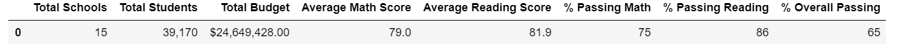
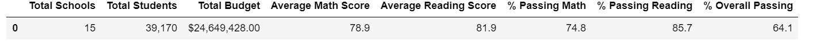
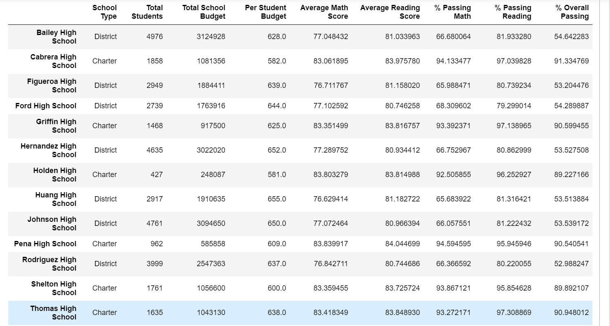
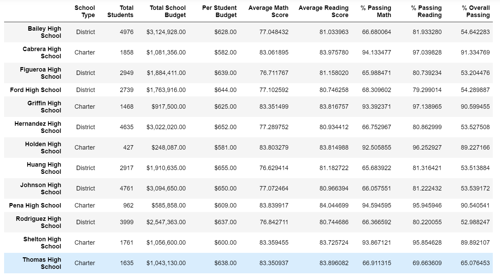

# School District Analysis

##  Overview of Analysis
The purpose of the analysis is to find trends on student scores to assist the school board in making decisions on school budgets.

## Results of Analysis
#### District Summary Dataframes Old vs. New
At a district level removing the math and reading scores of all the ninth grade students at Thomas High School hardly affected the overall averages of the entire district.
###### Old District Dataframe

###### New District Dataframe

#### School Summary Dataframe
At an individual shool level removing the math and reading scores of all the ninth grade students at Thomas High School greatly impacted the outcome of the averages of Thomas High School compared to the other schools as well as the original unedited school summary dataframe.
###### Old School Summary

###### New School Summary

###### Reading and Math Scores Old vs. New
Replacing the ninth grade scores for THS have affected the math and reading scores by having the new dataframe show all scores for the grade as "NaN". In the old data frame it showed that the ninth graders scored around 83%.

###### Scores by School Spending Old vs. New
Changing the scores for all ninth grade students in THS had no affect on the outcome on the scores by School spending when compared to the old an dnew dataframe.

###### Scores by School Size Old vs. New
The scores for school type were only slightly affected by removing all the ninth grade student scores for Thomas High School.

###### Scores by Type Old vs. New
Changing the scores for all the ninth grade students at Thomas High School also had no affect on the outcome on scores by type.

#### Summary
The only noteworthy changes that were done to the dataframes were the outcomes based on average grades both reading and math both at the district level and individual school level. Most changes were seen at the individual school level.
